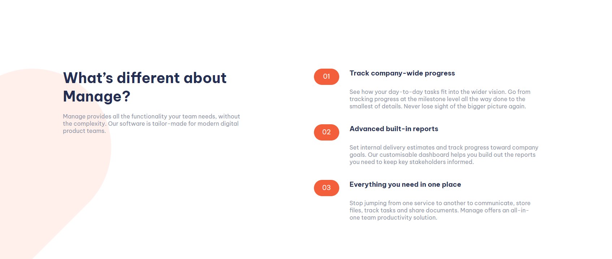
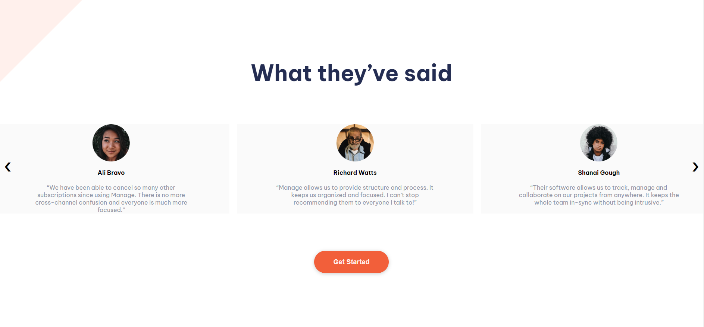
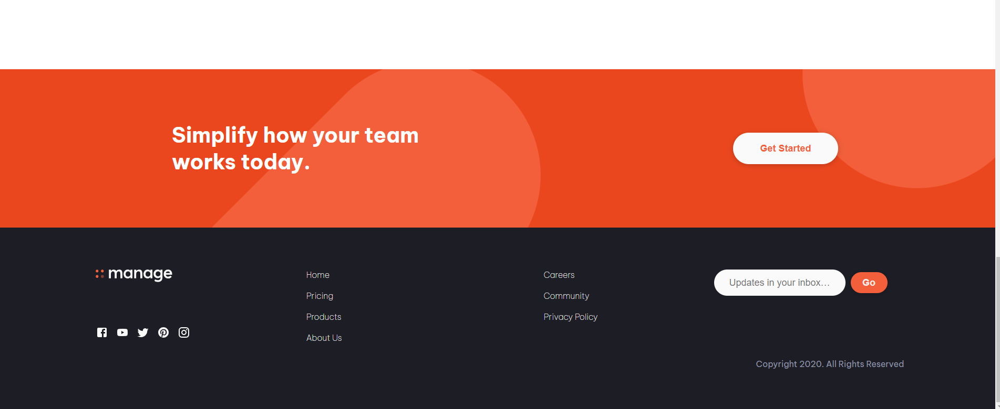

# Frontend Mentor - Manage landing page solution

This is a solution to the [Manage landing page challenge on Frontend Mentor](https://www.frontendmentor.io/challenges/manage-landing-page-SLXqC6P5). Frontend Mentor challenges help you improve your coding skills by building realistic projects. 

## Table of contents

- [Frontend Mentor - Manage landing page solution](#frontend-mentor---manage-landing-page-solution)
  - [Table of contents](#table-of-contents)
  - [Overview](#overview)
    - [The challenge](#the-challenge)
    - [Screenshot](#screenshot)
    - [Links](#links)
    - [Built with](#built-with)
    - [What I **learned**](#what-i-learned)
    - [Continued development](#continued-development)
  - [Author](#author)

## Overview

### The challenge

Users should be able to:

- View the optimal layout for the site depending on their device's screen size
- See hover states for all interactive elements on the page
- See all testimonials in a horizontal slider
- Receive an error message when the newsletter sign up `form` is submitted if:
  - The `input` field is empty
  - The email address is not formatted correctly

### Screenshot

 
### Links

- Solution URL: [Add solution URL here](https://your-solution-url.com)
- Live Site URL: [Add live site URL here](https://your-live-site-url.com)

### Built with

- Semantic HTML5 markup
- CSS custom properties
- Flexbox
- CSS Grid
- [React](https://reactjs.org/) - JS library
- Mui(Material UI) -Mui was used to import the socials logos. It is easy to style svg imgs that plane imgs.

### What I **learned**

  I didn't learn anything new relatent to JavaScript, but the same can't be said about CSS.
  One of the thing that i learned was how to change which element should be in the background of other, like choosing in which layer a element will be, to do that i used the property z-index of CSS. To choose what element will be in the front or back of another, you only need to add a lower value to element you want to have as background and higher values to the ones you want to have in the front: 
    <pre>
      <code>
        .backgroundElement {
         z-index:-1;
        }
        .Content {
          z-index:1;
        }
      </code>
    </pre>
  I used this property to put an imagem behind a div's text but not behind the div itself.

  Other thing that i have learned was how to remove parts of something like an image from a div.
  On the simply section there are two images but both of them are not fully on the div and the parts there are not on the div are cutted out. To do this effect and put on the parent div the property overflow with the value hidden, doing this anything that scapes the div will be cutted.

  The last thing that i learned was a way to use the property transitioX to make the carousel.To make it  i just used classes with diffent values of transitioX to push the review div forward and backwands.
  If you want a better expanation on how i did it ask in the comments or on some of my socials
  

### Continued development
Well, as you can see in the code there is some code that can be improved, like more use of components, less reption of code and some more.
One thing that make me think on change the way that I develop a website, was the idea of beginning the design by the mobile version, I'll try this on my next projects.

## Author

- Website - [Gabriel Francisco](https://www.your-site.com)
- Frontend Mentor - [@gab9244](https://www.frontendmentor.io/profile/gab9244)
- Linkedin - [gabriel-francisco-s](https://www.linkedin.com/in/gabriel-francisco-s/)
- Github - (https://github.com/gab9244)

